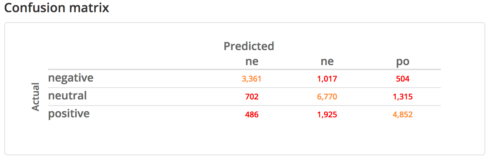
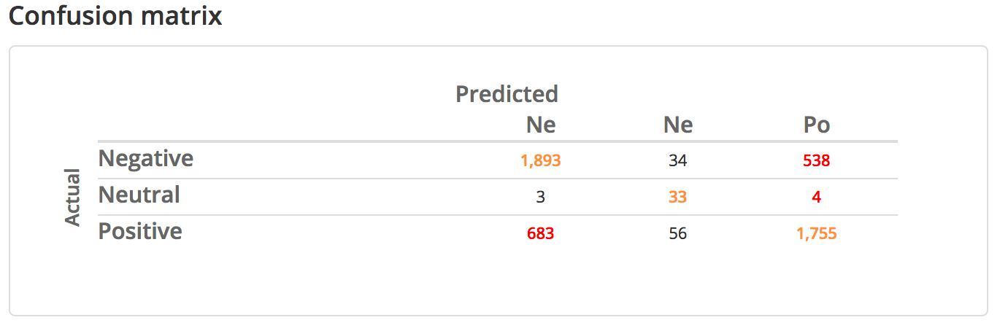

**work in progress, may31/2017**

<hr style="height:2px; background-color: gray; color:gray;">


- part1: quick description of idea, plot + validate twitter btc price strategy (*just twitter + external btc data*)
- part2: use monkeylearn classifiers to measure sentiment abt stuff, moving to btc topic (*introduce monkeylearn api*)
- part3: identify key dates, assess rel'ship btwn btc sentiment and price (*limitations of twitter api become obvious here*)

boosh did caching work?!


```{r setup, include=FALSE}
knitr::opts_chunk$set(message=FALSE, warning=FALSE, eval=TRUE)
```

<hr style="height:2px; background-color: gray; color:gray;">


The use of twitter data for estimating public sentiment about issues can still be considered a fledgling-ish field. Here we assess the degree to which a fairly naive sentiment classifier can be used to predict the trajectory of the average bitcoin trading price, over time. The catch is that we'll only use data publicly available via the twitter API. This is limiting in a few respects, chief among which is that targeting specific historical date ranges is basically impossible with only the standard twitter API tools (to my knowledge, at least). A scaled-up (and idealized) version of this strategy would use firehose output for bitcoin-related keywords at particular time intervals during which bitcoin trading prices are volatile. 


linxe to put in final post:

* [the concept of a "twitter-driven" trading bot](https://thestack.com/world/2015/05/08/three-steps-to-building-a-twitter-driven-trading-bot/)
* [documentation for `monkeylearn::` R package](LINK)
* [twitter firehose vs api (and api's in general)](https://brightplanet.com/2013/06/twitter-firehose-vs-twitter-api-whats-the-difference-and-why-should-you-care/)
* ...


<br>

### 1. btc prices from twitter

<hr style="height:1px; background-color:lightgray; color:lightgray;">

#### set up twitter api

```{r paqqs, eval=TRUE}
# load dependencies:

# - for data acquisition and processing
library("twitteR");   library("ROAuth");   library("httr")
library("lubridate"); library("reshape2"); library("dplyr")

# - for displaying results
library("ggplot2"); library("scales"); library("knitr")

# set auth cache to false to avoid prompts in `setup_twitter_oauth()`
options(httr_oauth_cache=FALSE)
```


```{r twtr_api}
# read in api keys and access tokens
keyz <- read.csv("../../../../keyz.csv", stringsAsFactors=FALSE)
# set up twitter auth -- call `setup_twitter_oauth()` w keys from `keyz`
setup_twitter_oauth(
  consumer_key    = keyz$value[keyz$auth_type=="twtr_api_key"], 
  consumer_secret = keyz$value[keyz$auth_type=="twtr_api_sec"], 
  access_token    = keyz$value[keyz$auth_type=="twtr_acc_tok"], 
  access_secret   = keyz$value[keyz$auth_type=="twtr_acc_sec"]
)

```


#### get btc price tweets + clean them up

The user @bitcoinprice is a bot that tweets out the average BTC trading price on an hourly basis. We want to build an hourly time-series dataset of BTC prices, starting right now and going back as far as the API will let us go.


```{r btc_price_tweets, cache=FALSE}
# want days to be formatted as default abbrevs, but ordered like this
day_labels <- c("Mon","Tue","Wed","Thu","Fri","Sat","Sun")

# query the API for max allowed num of tweets (3200) from user @bitcoinprice,
# then clean up the data, toss all the info we don't want/need, + call it `dat`
dat <- userTimeline(user="bitcoinprice", n=3200, excludeReplies=TRUE)  %>% 
  # convert json-ish tweets to a df
  twListToDF()                                                         %>% 
  # not interested in retweeted content
  filter(!isRetweet)                                                   %>% 
  # make time-series easier to deal with
  mutate(date      = date(created),
         hour      = hour(created),
         date_time = as.POSIXct(created, tz="UTC"))                    %>%
  # get day of the week, give them quick labels as defined above
  mutate(day       = weekdays(date_time, abbreviate=TRUE))             %>% 
  mutate(day       = factor(day, levels=day_labels))                   %>%
  # put colnames in my preferred format
  rename(data_src  = screenName,   
         num_fav   = favoriteCount, 
         num_RT    = retweetCount, 
         is_RT     = isRetweet)                                        %>% 
  # toss everything that's not relevant, arrange as desired
  select(data_src,  date_time,  date,   hour,  day, 
         num_fav,   num_RT,     is_RT,  text)
  
```

The tweets -- now in `dat$text` are completely formulaic, and have the following shape:

> @bitcoinprice: The average price of Bitcoin across all exchanges is <dddd.dd> USD

where *<dddd.dd>* is the string that we want to extract and convert to numeric. We'll extract it with some straightforward regex-ing, performing a couple of quality control checks along the way.

```{r extract_price}
# a tweet consists of: toss[1] + "dddd.dd" + toss[2]
toss <- c("The average price of Bitcoin across all exchanges is ", " USD")

# check that all tweets are formulaic + as expected
if (!all(grepl(paste0(toss[1], "\\d*\\.?\\d*", toss[2]), dat$text))){
  warning("careful -- tweets not as formulaic as they may seem! :/ ")
}

# given formulaic tweets, remove `toss` + extract price from `dat$text`
dat$price <- gsub(paste0(toss, collapse="|"), "", dat$text, perl=TRUE)

# check we don't have any words/letters left before converting to numeric
if (sum(grepl("[a-z]", dat$price)) > 0){
  warning("careful -- some tweets were not in expected format! :o ")
}

# now convert to numeric
dat$price <- as.numeric(dat$price)
```

Quick inspection reveals that there's something anomalous about one of the tweets: on 2017-03-14 15:00:03, @bitcoinprice says the average trading price is \$1.25. A cursory glance at the surrounding data points suggests that it's probably meant to be \$1225.00.[^1]

[^1]: **exercise**: what does this suggest about how the @bitcoinprice bot works?!

```{r}
# fix the incorrect data point
dat$price[dat$price==1.25] <- dat$price[dat$price==1.25] * 1000
```

And make a quick table for a final quality check -- seems reasonable for the last 4-ish months of BTC pricing. 

```{r}
kable(table(cut(dat$price, breaks=seq(0, max(dat$price), 500))),
      col.names=c("price range (USD)","count"))
```


#### plot the data

Now we can look at the price of BTC over recent months, using @bitcoinprice's tweets. We'll validate the data with an external source in the next step.

```{r plot_pricetweets, fig.width=7.5, fig.height=3.5, out.width="95%"}
# what's our date range? (3200 hourly tweets so should be 3200/24 days ~ 4mo)
range(dat$date)

# make some plots

# price over time for full range of tweets
ggplot(dat, aes(x=date_time, y=price)) +
  geom_line() + scale_y_continuous(limits=c(0, 3000))

# aggregate over day-hour pairs to look at typical structure of a week
pdat <- dat %>% select(day, hour, price) %>% group_by(day, hour) %>% summarize(
  mean_price = mean(price)
) %>% data.frame()

ggplot(pdat, aes(x=hour, y=mean_price)) + 
  geom_line() + 
  facet_wrap(~day, ncol=7)

```


#### inspect + validate accuracy on external data_src

Just to make sure our prices are accurate, we can validate them on an external source of data. Here we'll use [bitcoinity.org](make a quick table for a final quality check -- seems reasonable), which offers a nice little data export feature on the price-tracking portion of their website. 

```{r validate_pricetweets, fig.width=7.5, fig.height=3.5, out.width="95%"}
# get external price data from bitcoinity.org
bitcoinity <- read.csv(
  "data/bitcoinity_data-price-volume.csv", 
  col.names=c("date","price","volume"),
  colClasses=c("Date","numeric","numeric")
)
bitcoinity$data_src <- "bitcoinity.org"

kable(head(bitcoinity, n=4))
```

Now plot the bitcoinity data on the same interval as the @bitcoinprice data. The result is sparser than the above plot since there's fewer data points per 24-hr period, but the pattern looks identical. Nice. 

```{r}
# the external data, plotted on the same interval as `dat` above:
ggplot(bitcoinity[bitcoinity$date >= min(dat$date), ], aes(x=date, y=price)) +
  geom_line() + scale_y_continuous(limits=c(0, 3000))
```


Just for reference, here's the trajectory of BTC since the very beginning (fml can't believe I didn't get in when I first heard about BTC back in 2011 :/). There's also a trading volume column in the bitcoinity data, which we'll plot in orange in the same window. 

```{r}
# want to display the all-time high price and date
fig_cap <- paste0(
  "all-time high: $", round(max(bitcoinity$price)), ", on ",
  bitcoinity$date[bitcoinity$price==max(bitcoinity$price)]
)

# the external data, plotted on the whole lifetime of btc:
ggplot(bitcoinity, aes(x=date, y=price)) +
  geom_line() + 
  geom_line(aes(x=date, y=volume/1e6), color="#ed9953") +
  geom_hline(yintercept=max(bitcoinity$price), 
             color="#8aa8b5", linetype="dashed") +
  annotate(geom="text", x=as.Date("2016-02-01"), y=max(bitcoinity$price)+100, 
           color="#8aa8b5", label=fig_cap) +
  scale_y_continuous(limits=c(0, 3000)) +
  scale_x_date(date_breaks="6 months") +
  theme(axis.text.x=element_text(angle=45, vjust=1, hjust=1),
        plot.caption=element_text(color="#ed9953", hjust=0)) +
  labs(y="average trading price (USD)",
       caption="(trading volume in orange)")
``` 

Everything looks fine, but to be totally sure we can merge the external data with the tweeted price data, and plot them against each other. 

```{r}
# first aggregate @bitcoinprice data to the day-level
tdat_simple <- dat %>% 
  mutate(date=as.character(date)) %>% 
  select(data_src, date, price) %>% 
  group_by(data_src, date) %>% summarize(
  price = mean(price, na.rm=TRUE)
) %>% data.frame()

# then cut the external data to the same interval and harmonize cols for merge
bitcoinity_simple <- bitcoinity %>% 
  filter(date >= min(dat$date)) %>% 
  select(data_src, date, price) %>% 
  mutate(date=as.character(date)) %>% 
  data.frame()

# check that a stack-merge would give us what we want -- yep
kable(rbind(head(tdat_simple, 2), head(bitcoinity_simple, 2)))

# date info got destroyed along the way, so fix it during merge
merged <- 
  rbind(tdat_simple, bitcoinity_simple) %>% 
  mutate(date = as.Date(date))

# now plot the merged data -- diff not even visible
ggplot(merged, aes(x=date, y=price, group=data_src, color=data_src)) +
  geom_line() + 
  scale_y_continuous(limits=c(0, 3000)) +
  scale_x_date(date_breaks="2 weeks") +
  theme(axis.text.x=element_text(angle=45, vjust=1, hjust=1)) +
  theme(legend.position="top")


# zoom in to see how big the differences that do exist are
merged_zoom <- merged %>% filter(date >= "2017-05-21" & date <= "2017-05-24") 

# get price differences for each day in `merged_zoom` 
# (each vec is alerady ordered by date so this is safe to do)
price_diffs <- 
  round(merged_zoom$price[merged_zoom$data_src=="bitcoinprice"] - 
          merged_zoom$price[merged_zoom$data_src=="bitcoinity.org"])

ggplot(merged_zoom, aes(x=date, y=price, group=data_src, color=data_src)) +
  geom_line() + 
  scale_y_continuous(limits=c(2000, 2500), breaks=c(2000, 2500)) +
  scale_x_date(date_breaks="1 day") +
  theme(legend.position="top") +
  annotate("text", x=unique(merged_zoom$date), y=2500, 
           label=paste0("$", abs(price_diffs), " diff"))
```

Interesting...The prices don't vary too much, but with automated trading, I imagine one could take huge advantage of knowing about the relative accuracy of different price reporting systems. Another thing to consider is that @bitcoinprice and bitcoinity.org draw samples at slightly different times. Given the volatility of bitcoin pricing, I'd say that even a difference of \$17 at a given date is well within a reasonable margin for measurement error.


### 2. tweet sentiment about btc

<hr style="height:1px; background-color:lightgray; color:lightgray;">

#### enter classifier

Monkeylearn is a nice web-based NLP service that allows you to programmatically send unstructured text to classifiers, taggers, and extractors that are hosted on the platform. The R bindings to the monkeylearn API (via [the `monkeylearn::` package](https://github.com/ropensci/monkeylearn)) take in some text and a specification of which classifier/extractor you want to use, and spit back classifications, sentiment scores, or whatever you requested from the classifier/extractor you specified.

```{r load_monkey}
# load monkeylearn api bindings
library("monkeylearn")

# get my private monkeylearn key from the keyz df
ml_key  <- keyz$value[keyz$auth_type=="monkey_pkey"]
```


What seem to be the two most popular sentiment classifiers designed specifically for tweet text are the following:

- [English Tweets Sentiment Analysis](https://app.monkeylearn.com/main/classifiers/cl_qkjxv9Ly/): "Classifying tweets in English according to their sentiment: positive, neutral or negative.
", built by Rodrigo Stecanella <br> (monkeylearn classifier id: `"cl_qkjxv9Ly"`)
- [Tweet Sentiment Analysis](https://app.monkeylearn.com/main/classifiers/cl_RWBfoo2B/): "Multi Language Twitter Sentiment Analysis", built by Nick Lee <br> (monkeylearn classifier id: `"cl_RWBfoo2B"`)

I'd expect the English-only classifier to be a bit better all else equal. A quick look at the confusion matrices for each classifier suggests that the English-specific one is more trustworthy.

```{r eval=TRUE, out.width="400px", fig.show='hold'}


```

Since we'll just be using a couple of classifiers in a couple of specific ways, it makes sense to wrap the `monkeylearn_classify()` function with some defaults we'll be using.[^2]

[^2]: note: `ml_classify()` assumes that the global variable `ml_key` is set to a valid monkeylearn API key. If it's not, you won't be able to send queries :/

```{r classify_func, cache=FALSE}
ml_classify <- function(text, id){
  # send the text and classifier id to ML, get analysis back
  monkeylearn_classify(
    request=text, 
    key=ml_key, 
    classifier_id=id,
    verbose=TRUE
  )
}

# set variables for the classifiers, for easier arg passing
clf_english <- "cl_qkjxv9Ly"
clf_multilg <- "cl_RWBfoo2B"
```


#### "validate" classifier on unabomber manifesto [sloppy!]

Let's see if the classifier(s) do anything remotely like what we want them to do. To be explicit: what we want it/them to do is to take in a bunch of tweets about bitcoin, and assign each of them a sentiment category (with a measure of confidence so we can filter out what seem to be pure guesses). 

One thing we could do is see how the classifiers do on tweets about topics for which we have clear expectations -- e.g. tweets about Kaitlyn Jenner should be positive (lol), tweets about Donald Trump should be...er...idk unfortunately. That'll be the eventual strategy, but in the interest of not losing interest, we'll validate with some more specific and longer texts. 

I'd say that one of the most "negative" things ever written in the English language would be [The Unabomber Manifesto](http://www.washingtonpost.com/wp-srv/national/longterm/unabomber/manifesto.text.htm). So let's make sure the classifiers consider it "negative."

```{r validate_classifiers, cache=FALSE}
# read in local copy of the unabomber manifesto -- "kaczynski (1995)"
unabomber_manif <- readLines("input/kaczynski1995.txt")

# query each of the two classifiers with the unabomber manifesto
unabomber_english_clf <- ml_classify(unabomber_manif, id=clf_english)
unabomber_multilg_clf <- ml_classify(unabomber_manif, id=clf_multilg)
```

Now make a quick table summarizing the Unabomber Manifesto results for each classifier.

```{r}
una_tbl_english <- unabomber_english_clf %>% group_by(label) %>% summarize(
  num_preds  = length(label),
  prop_preds = num_preds / nrow(unabomber_english_clf),
  avg_prob   = mean(probability, na.rm=TRUE)
) %>% mutate_if(is.numeric, round, digits=2) %>% mutate(clf = "clf_english")
```


```{r}
una_tbl_multilg <- unabomber_multilg_clf %>% group_by(label) %>% summarize(
  num_preds  = length(label),
  prop_preds = num_preds / nrow(unabomber_multilg_clf),
  avg_prob   = mean(probability, na.rm=TRUE)
) %>% mutate_if(is.numeric, round, digits=2) %>% mutate(clf = "clf_multilg")
```

As expected, looks like the English-only one matches our intuitions way better -- it classifies most portions of the manifesto as "negative" -- 66% -- and only 12% as "positive." The multilingual sentiment analyzer classifies 45% as "Negative", but even more -- 53% -- as "Positive"! Plus, the multi-language one very much dislikes abstaining from classifying something as positive or negative -- almost totally refusing to use the `"Neutral"` label. In other words, *this is one thirsty classifier*. 

```{r}
kable(rbind(una_tbl_english, una_tbl_multilg))
```

Let's also make sure the classifiers consider something clearly positive to be as such. Song of Solomon from the Old Testament is pretty "positive" in a certain sense, I'd say :p

```{r sos_classify, cache=FALSE}
# a positive text
song_of_solomon <- readLines("input/song_of_solomon.txt")

# query each of the two classifiers with the unabomber manifesto
songos_english_clf <- ml_classify(song_of_solomon, id=clf_english)
songos_multilg_clf <- ml_classify(song_of_solomon, id=clf_multilg)
```


Now make a quick table summarizing the Song of Solomon results for each classifier.

```{r}
sos_tbl_english <- songos_english_clf %>% group_by(label) %>% summarize(
  num_preds  = length(label),
  prop_preds = num_preds / nrow(unabomber_english_clf),
  avg_prob   = mean(probability, na.rm=TRUE)
) %>% mutate_if(is.numeric, round, digits=2) %>% mutate(clf = "clf_english")
```


```{r}
sos_tbl_multilg <- songos_multilg_clf %>% group_by(label) %>% summarize(
  num_preds  = length(label),
  prop_preds = num_preds / nrow(unabomber_multilg_clf),
  avg_prob   = mean(probability, na.rm=TRUE)
) %>% mutate_if(is.numeric, round, digits=2) %>% mutate(clf = "clf_multilg")
```

The results here are less clear than in the previous case. But still, the multilingual classifier thinks ~30% of SoS is "negative." In light of that and in light of its apparent avoidance of the `Neutral` label, I'd say we can safely conclude that the English-only classifier is more likely to give us what we want.[^3] 

[^3]: Whether that should count as "likely" at all in the first place is definitely debatable. Buuuut let's just assume it gives us a legitimate measure of positivity/negativity -- if we find a much better classifier in the future, we can just sub it in and then we'll have results we can trust better.

```{r}
kable(rbind(sos_tbl_english, sos_tbl_multilg))
```


#### average sentiment measure abt btc (last ~4mo)

With our tweet sentiment classifier now selected, let's get a random sample of bitcoin-related tweets from the last few months.

```{r sample_btc_tweets, cache=FALSE}
# get random sample of dates from first 100 days of 2017
dates <- as.Date(sample(1:100, size=10), origin="2017-01-01") %>% as.character()

# quick wrapper for searchTwitter() with desired args
get_tweets <- function(date, term="bitcoin", num=100){
  tweets <- searchTwitter(term, n=num, resultType="popular", since=date)
  return(tweets)
}

# collect tweets for each date, convert the collections to a single df
tweets <- twListToDF(sapply(dates, get_tweets))

# apply the same transformations we did to the btc price tweets, to clean them
tweets <- tweets %>% filter(!isRetweet) %>% 
  mutate(date=date(created), hour=hour(created), 
         date_time=as.POSIXct(created, tz="UTC")) %>%
  mutate(day=weekdays(date_time, abbreviate=TRUE)) %>% 
  mutate(day=factor(day, levels=day_labels)) %>%
  rename(data_src=screenName, num_fav=favoriteCount, 
         num_RT=retweetCount, is_RT=isRetweet) %>% 
  select(data_src, date_time, date, hour, day, num_fav, num_RT, is_RT, text)

# peep the first couple of rows
head(tweets, n=2)
```

Now we can use `clf_english` to classify the tweets: 

```{r classifier1, fig.show='hold', fig.width=5, fig.height=3.5, out.width="47.5%", cache=FALSE}
# classify the tweets
tweets_clf <- ml_classify(text=tweets$text, id=clf_english)

# summarize the classification results
tweets_tbl <- tweets_clf %>% group_by(label) %>% summarize(
  num_preds  = length(label),
  prop_preds = num_preds / nrow(tweets_clf),
  avg_prob   = mean(probability, na.rm=TRUE)
) %>% mutate_if(is.numeric, round, digits=2)

# look at the table to see results
kable(tweets_tbl)
```

Interesting -- we're getting around 85% "neutral" classifications, with a decent average degree of confidence...What if we filter out all rows with less than, say, 50% confidence?

```{r}
tweets_confident <- tweets_clf %>% filter(probability > .5)

kable(tweets_confident %>% group_by(label) %>% summarize(
  num_preds  = length(label),
  prop_preds = num_preds / nrow(tweets_confident),
  avg_prob   = mean(probability, na.rm=TRUE)
) %>% mutate_if(is.numeric, round, digits=2))
```

Not a whole lot more illuminating, and this ate up a lot of our sample. So, acknowledging that we live in an imperfect world, we'll just go with the raw classifications. Eventually we'd want to define a sentiment metric given a table of classifications like the ones we get from `ml_classify()`. But the output is simple enough that we can just eyeball it and quasi-subjectively evaluate whether what we get is reasonable. 

We should also probably search for related terms, including those with hashtags -- for example "#bitcoin", "btc", "#btc", "cryptocurrency", etc. For now that's left for future work. Shoot me [an email](mailto:tjleffel@gmail.com) if you have some ideas about how this could be done systematically. 


### 3. btc-related tweet sentiment on turbulent btc days

<hr style="height:1px; background-color:lightgray; color:lightgray;">

Let's identify a handful of days with sharp bitcoin price increases. Then we'll query the twitter API to grab btc-related tweets from those dates (if we're able to!), and we'll get their sentiments classified. 

Then we'll do the same thing for a handful of days with sharp bitcoin price *decreases*. If the sentiments trend in the same direction as the price changes, then I'd say we have ourselves a starting point for an entirely twitter-drive bitcoin trading bot. If not, back to the drawing board!

To make life easier, we'll start by collapsing the price data to the individual-day level.[^4] 


[^4]: I think the mean over each hourly tweet should be fine; maybe median could give us a slightly different perspective. Not sure, but worth thinking about some more. 

```{r}
# let's keep `day` around just for kicks
dat_day <- dat %>% group_by(date, day) %>% summarize(
  price = mean(price, na.rm=TRUE)
)

# confirm that the data is sorted by date before using `lag()`
identical(dat_day$date, sort(dat_day$date))


# get the price change from the previous day
dat_day$price_change <- round(dat_day$price - lag(dat_day$price))
```


#### 3.1 identify sharp *increase* days + measure sentiment

Just use the three largest increase days:
```{r}
# get row indices for 3 largest increase days
top3 <- order(dat_day$price_change, decreasing=TRUE, na.last=TRUE)[1:3]

# get the date vals for those three days
(inc_days <- as.character(dat_day[top3, ]$date))
```

For now, we'll only use the dates but in principle the actual prices could be useful too. 

#### 3.2 identify sharp *decrease* days + measure sentiment

Just use the three largest decrease days:
```{r}
# get row indices for 3 largest decrease days
bot3 <- order(dat_day$price_change, decreasing=FALSE, na.last=TRUE)[1:3]

# get the date vals for those three days
(dec_days <- as.character(dat_day[bot3, ]$date))
```

#### 3.3 obtain relevant tweets for each date of interest

Unfortunately but unsurprisingly, the increase days are basically adjacent to two of the decrease days. Even so, though, we can just request a shitload of tweets, toss the ones that aren't on the target date, and request again. If we do this enough times, we'll end up with a suitable number of tweets for each day. Let's set the threshold at 100. In other words, for each day in `inc_days` and `dec_days`, we will search for bitcoin-related tweets on that day using the twitter search API. Since it won't give us exactly what we want, we'll just keep querying it until we have 100 btc-related tweets per day. Then we'll measure their sentiment and (informally + impressionistically) assess the relationship.

```{r get_changetweets, cache=FALSE}
dates <- as.character(c(dec_days, inc_days))
# we'll just do five iterations and take whatever we get.
# some fiddling around suggests that ought to give us close to 100 of each date

# in a perfect world we'd write a while-loop and just wait till our
# criteria are satisfied...

# container to catch the query results
twitlist <- vector(mode="list", length=length(dates))

# collect tweets for the day preceding each date by querying search api
for (x in seq_along(dates)){
  twitlist[[x]] <- searchTwitter(
      searchString="bitcoin", n=100, 
      since=dates[x], until=as.character(as.Date(dates[x]) + 1)
  )
}

# convert the tweet collections to a single df
pricechange_tweets <- 
  twListToDF(unlist(twitlist)) %>% 
  mutate(date = as.character(date(created))) %>% 
  filter(date %in% dates) %>% data.frame() 

if (FALSE){
  # write file interactively first time, so doesn't get written w each compile
  write.csv(pricechange_tweets, "../../../../btc_tweets.csv", row.names=FALSE)
}

```

Well, turns out that just using the search API in this way currently only gets us tweets for four of the six dates we targeted. Fortunately for us, the four we got are evenly distributed between the increase days and the decrease days! 

```{r}
# the six dates we're targeting
inc_days; dec_days

# the four that we have data for
unique(pricechange_tweets$date)
```


#### 3.4 assess relationship between price and sentiment

```{r classify_pricechange_tweets, cache=FALSE}
# split the dataset by inc/dec_days
inc_tweets <- pricechange_tweets[pricechange_tweets$date %in% inc_days, ]
dec_tweets <- pricechange_tweets[pricechange_tweets$date %in% dec_days, ]

# classify the tweets
inc_tweets_clf <- ml_classify(text=inc_tweets$text, id=clf_english)
dec_tweets_clf <- ml_classify(text=dec_tweets$text, id=clf_english)
```


```{r}
# display results for increasing days
inc_tweets_tbl <- inc_tweets_clf %>% group_by(label) %>% summarize(
  num_preds  = length(label),
  prop_preds = num_preds / nrow(inc_tweets_clf),
  avg_prob   = mean(probability, na.rm=TRUE)
) %>% mutate_if(is.numeric, round, digits=3)

kable(inc_tweets_tbl)
```


```{r}
# and here's our results for decreasing days!
dec_tweets_tbl <- dec_tweets_clf %>% group_by(label) %>% summarize(
  num_preds  = length(label),
  prop_preds = num_preds / nrow(dec_tweets_clf),
  avg_prob   = mean(probability, na.rm=TRUE)
) %>% mutate_if(is.numeric, round, digits=3)

kable(dec_tweets_tbl)
```


```{r}
# tag the summaries and then stack them for plotting
inc_tweets_tbl$event <- "bitcoin_price_increase"
dec_tweets_tbl$event <- "bitcoin_price_decrease"

change_tweets_table <- 
  rbind(inc_tweets_tbl, dec_tweets_tbl) 

sentiment_ratios <- change_tweets_table %>% 
  group_by(event) %>% summarize(
    num_pos = sum(num_preds)
  )

get_ratio <- function(df, event){
  # number of positive tweets
  num_pos <- 
    df$num_preds[df$event==event & df$label=="positive"]
  # number of negative tweets
  num_neg <- 
    df$num_preds[df$event==event & df$label=="negative"]
  
  # ratio of positive to negative tweets
  return(num_pos / num_neg)
}
```


```{r}
# ratio of positive to negative tweets on BTC price increase days
(inc_ratio <- get_ratio(df=change_tweets_table, event="bitcoin_price_increase"))
```

```{r}
# ratio of positive to negative tweets on BTC price decrease days
(dec_ratio <- get_ratio(df=change_tweets_table, event="bitcoin_price_decrease"))
```

Welp, looks like the ratio of positive to negative tweets is indeed higher on two of the three days when the price went up the most, compared to two of the three days when the price went down the most!

That's a cute fact, but is it a coincidence?! Quite possibly. Also quite possibly not. I think it suggests that the question is worth looking into more rigorously. 


```{r}
# now plot the results side by side
## **FIGURE OUT A NICE CUTE VISUALIZATION TO PUT HERE AT THE END** 
##   (IF I GET AROUND TO IT!)
```


### 4. wrapping up + next steps

<hr style="height:1px; background-color:lightgray; color:lightgray;">

**The natural next step is to run a couple of quick significance tests to help understand the nature of the result/difference...**

Here's a list of some things that are both important for this idea to work, and are also totally mysterious and hard to figure out! 

1. What is the direction of causation between tweet sentiment and price? e.g. do people freak out and that causes prices to go down, or do prices go down for other reasons and then that gets reflected in people's tweets? Interesting questions but elusive! Relative timing issues are super important here -- see point 2. for discussion.

2. Can we get finer-grained temporal resolution on topic-related tweets? That'd be tremendously helpful since it's easy to get temporally fine-grained price data. The only way is probably some kind of bridge to the twitter firehose. Probably will need to look more into services like [gnip](http://support.gnip.com/apis/search_api2.0/) to solve this problem. 

Relevant to this issue is the following quote (which might be outdated at this point -- not totally sure): 

> "A question that I'm often asked is how to retrieve data from the past, generally people are doing a study on some major event that has already happened (e.g. Arab Spring, an election, etc). Using the Twitter API this is impossible as you can only go back a small amount. However, if you have the ability to look ahead, it is easy to enable a prospective study by collecting data and automatically persisting it to a database." 2015, from  `twitteR::` package documentation

3.  How can we get a higher-quality sentiment classifier?! (without having to write one myself!) In other words, if you're an NLP guru interested in this stuff, [shoot me an email](mailto:tjleffel@gmail.com)

4. What even is the nature of the signal?! A lot of the stuff you see in these tweets reads like an ad, so the degree to which these tweets can even be used to measure "public sentiment" or even "sentiment" about bitcoin might be kind of questionable in the first place. To be continued...maybe.


<br><br>
<hr><hr>
<br><br>


<link rel="stylesheet" type="text/css"
href="https://fonts.googleapis.com/css?family=Open+Sans:300,400,400i,700">

<link href="https://fonts.googleapis.com/css?family=Roboto+Mono:300,400,500" rel="stylesheet">

  <style>
body {
  padding: 10px;
  font-size: 12pt;
  font-family: 'Open Sans', sans-serif;
}

h1 { 
  font-size: 20px;
  color: DarkGreen;
  font-weight: bold;
}

h2 { 
    font-size: 16px;
    color: green;
}

h3 { 
  font-size: 24px;
  color: green;
  font-weight: bold;
}

h4 { 
  font-size: 18px;
  color: green;
  font-weight: bolder;
  padding-top: 10px;
}

li {
  padding: 3px;
}

code {
  font-family: 'Roboto Mono', monospace;
  font-size: 14px;
}

blockquote {
  font-style: italic;
}

pre {
  font-family: 'Roboto Mono', monospace;
  font-size: 14px;
}

p {
  margin-top: 30px;
  margin-bottom: 15px;
}

</style>


<!-- END OF DOCUMENT IS HERE -->

